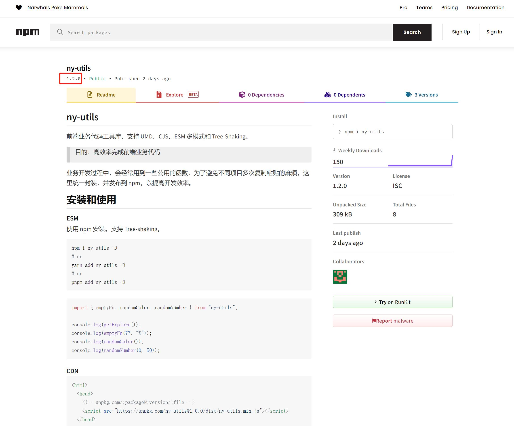

# 项目简介

## ny-utils

前端业务代码工具库，支持 UMD、CJS、ESM 多模式和 Tree-Shaking。

> 目的：高效率完成前端业务代码

业务开发过程中，会经常用到一些公用的函数，为了避免不同项目多次复制粘贴的麻烦，这里统一封装，并发布到 npm，以提高开发效率。

## 安装和使用

### ESM

使用 npm 安装。支持 Tree-shaking。

```shell
npm i ny-utils -D
# or
yarn add ny-utils -D
# or
pnpm add ny-utils -D
```

```js
import { emptyFn, randomColor, randomNumber } from "ny-utils";

console.log(getExplore());
console.log(emptyFn(77, "%"));
console.log(randomColor());
console.log(randomNumber(0, 50));
```

### CDN

引入在线地址的话，必须要遵循以下格式！！！

`unpkg.com/:package@:version/:file`

version 在 [npm](https://www.npmjs.com/package/ny-utils) 中查看。



```html
<html>
  <head>
    <!-- unpkg.com/:package@:version/:file -->
    <script src="https://unpkg.com/ny-utils@1.0.0/dist/ny-utils.min.js"></script>
  </head>

  <body>
    <div id="app">Hello World!</div>
    <button onclick="nyUtils.toFullScreen()">全屏</button>
    <button onclick="nyUtils.exitFullScreen()">退出全屏</button>
    <script>
      nyUtils.hello();

      let explore = nyUtils.getExplore();
      let os = nyUtils.getOS();
      let color = nyUtils.randomColor();
      let num = nyUtils.randomNumber(0, 50);
      let amount = nyUtils.standardAmount(7000123);
      let integerAmount = nyUtils.standardIntegerAmount(7000123);
      let digit = nyUtils.digitUppercase(777777777);
      let loseTime = nyUtils.formatRemainTime("2022-11-10");
      let passTime = nyUtils.formatPassTime("2022-11-10");
      let formatDater = nyUtils.dateFormater("YYYY-MM-DD", "2020.11.29");
      let emptyStr = nyUtils.emptyFn(77, "%");

      console.log("type:version=", explore);
      console.log("system=", os);
      console.log("color=", color);
      console.log("num=", num);
      document.getElementById("app").style.color = color;
      console.log("standard=", amount);
      console.log("integerAmount=", integerAmount);
      console.log("digit=", digit);
      console.log("loseTime=", loseTime);
      console.log("passTime=", passTime);
      console.log("formatDater=", formatDater);
      console.log("emptyFn=", emptyStr);

      nyUtils.goodbye();
    </script>
  </body>
</html>
```

### CJS

在 node 环境中引入 `https://unpkg.com/ny-utils@1.0.0/dist/cjs/index.js` 使用。
